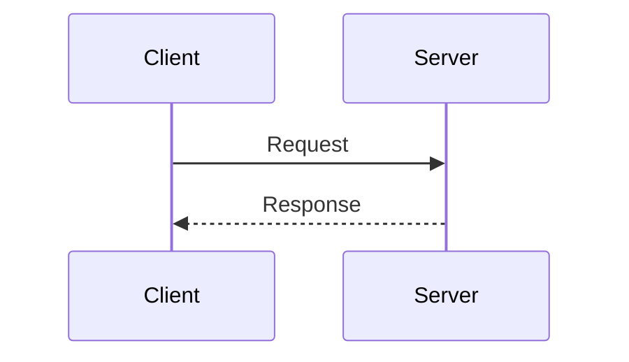
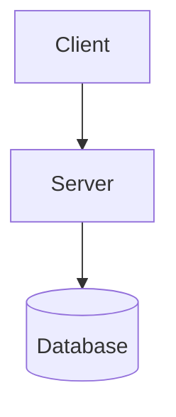
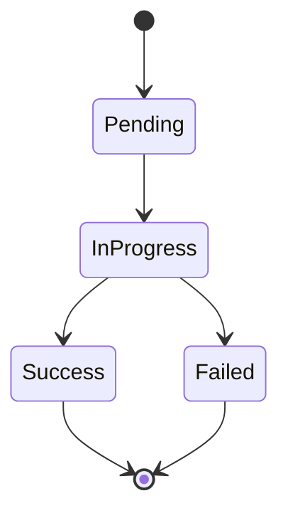

# HTBase Diagrams Index

This directory contains visual documentation of HTBase's architecture, request flows, and system interactions.

## Table of Contents

- [Overview](#overview)
- [How to View Diagrams](#how-to-view-diagrams)
- [Diagram Categories](#diagram-categories)
- [Quick Reference](#quick-reference)
- [Diagram Descriptions](#diagram-descriptions)

---

## Overview

All diagrams in this directory use **Mermaid** syntax, a markdown-compatible diagramming language. Mermaid diagrams are:
- ✅ Version-controlled (plain text)
- ✅ Rendered automatically in GitHub, VS Code, and many markdown viewers
- ✅ Easy to update and maintain
- ✅ Accessible (can be read as text)

---

## How to View Diagrams

### GitHub / GitLab
Diagrams render automatically when viewing markdown files on GitHub or GitLab.

### VS Code
Install the **Mermaid Markdown Preview** extension:
```bash
code --install-extension bierner.markdown-mermaid
```
Then open any `.md` file and use the markdown preview (Ctrl+Shift+V / Cmd+Shift+V).

### Online Mermaid Editor
Copy diagram code and paste into:
- **Mermaid Live Editor**: https://mermaid.live
- Supports real-time editing and export to PNG/SVG

### JetBrains IDEs (IntelliJ, PyCharm, WebStorm)
Mermaid support is built-in. Open any `.md` file and view the preview pane.

### Obsidian
Mermaid diagrams render automatically in Obsidian markdown files.

---

## Diagram Categories

### 1. **Sequence Diagrams** - Request Flow Visualization
**File:** [SEQUENCE_DIAGRAMS.md](./SEQUENCE_DIAGRAMS.md)

Shows the temporal sequence of interactions between components.

**Diagrams Included:**
- Firebase API endpoint flows (add-pocket-article, download)
- Archive processing pipeline
- Dual database write flows (success + failure modes)
- Error handling scenarios
- Complete end-to-end system flow

**Best For:** Understanding how requests flow through the system over time.

---

### 2. **Component Diagrams** - System Architecture
**File:** [ARCHITECTURE_OVERVIEW.md](../ARCHITECTURE_OVERVIEW.md)

Shows the structural organization of components and their relationships.

**Diagrams Included:**
- Component architecture (API Gateway, Database Layer, Task System, Archivers, Storage)
- Thread model and background workers
- Deployment architecture (single-server + production)

**Best For:** Understanding system structure and component responsibilities.

---

### 3. **State Machine Diagrams** - Artifact Lifecycle
**File:** [SEQUENCE_DIAGRAMS.md](./SEQUENCE_DIAGRAMS.md#7-artifact-status-state-machine)

Shows the possible states and transitions for archive artifacts.

**States:**
- `pending` → `in_progress` → `success` / `failed`

**Best For:** Understanding artifact status progression.

---

### 4. **Data Flow Diagrams** - Information Movement
**File:** [SEQUENCE_DIAGRAMS.md](./SEQUENCE_DIAGRAMS.md#9-data-flow-diagram)

Shows how data moves through the system from input to storage.

**Flow:**
- Client Request → API Gateway → Database → Task Queue → Workers → Storage

**Best For:** Understanding data transformation and storage.

---

## Quick Reference

### Most Common Diagrams

| What I Want to Understand | Diagram to View | File |
|---------------------------|----------------|------|
| How Firebase endpoints work | [POST /firebase/add-pocket-article Flow](#1-post-firebaseadd-pocket-article-flow) | [SEQUENCE_DIAGRAMS.md](./SEQUENCE_DIAGRAMS.md#1-post-firebaseadd-pocket-article-flow-happy-path) |
| How downloads work | [GET /firebase/download Flow](#2-get-firebasedownload-flow) | [SEQUENCE_DIAGRAMS.md](./SEQUENCE_DIAGRAMS.md#2-get-firebasedownload-flow) |
| Complete request lifecycle | [Complete End-to-End Flow](#6-complete-end-to-end-flow) | [SEQUENCE_DIAGRAMS.md](./SEQUENCE_DIAGRAMS.md#6-complete-end-to-end-flow-all-stages) |
| How dual database works | [Dual Database Write Flow](#4-dual-database-write-flow) | [SEQUENCE_DIAGRAMS.md](./SEQUENCE_DIAGRAMS.md#4-dual-database-write-flow) |
| System architecture overview | [Component Architecture](#component-architecture) | [ARCHITECTURE_OVERVIEW.md](../ARCHITECTURE_OVERVIEW.md#component-architecture) |
| Error handling | [Error Handling Flows](#5-error-handling-flows) | [SEQUENCE_DIAGRAMS.md](./SEQUENCE_DIAGRAMS.md#5-error-handling-flows) |
| Background processing | [Archive Processing Pipeline](#3-archive-processing-pipeline) | [SEQUENCE_DIAGRAMS.md](./SEQUENCE_DIAGRAMS.md#3-archive-processing-pipeline) |
| Deployment architecture | [Deployment Architecture](#deployment-architecture) | [ARCHITECTURE_OVERVIEW.md](../ARCHITECTURE_OVERVIEW.md#deployment-architecture) |

---

## Diagram Descriptions

### 1. POST /firebase/add-pocket-article Flow

**Purpose:** Shows the complete flow when a client adds a Pocket article for archiving.

**Key Steps:**
1. Client sends POST request with Pocket metadata
2. API Gateway authenticates and rate limits
3. Database write (PostgreSQL + Firestore dual-write)
4. Task enqueueing
5. Background processing
6. Archive execution and upload
7. Status polling

**Variations:**
- Happy path (new article)
- Article already exists (duplicate detection)

**When to Use:** Understanding the full lifecycle of article archival requests.

**View:** [SEQUENCE_DIAGRAMS.md - Section 1](./SEQUENCE_DIAGRAMS.md#1-post-firebaseadd-pocket-article-flow-happy-path)

---

### 2. GET /firebase/download Flow

**Purpose:** Shows how signed download URLs are generated for archived content.

**Key Steps:**
1. Client requests download URL
2. API Gateway authenticates
3. Database lookup (find article + artifact)
4. GCS signed URL generation
5. Return URL to client
6. Client downloads directly from GCS

**When to Use:** Understanding how clients retrieve archived content.

**View:** [SEQUENCE_DIAGRAMS.md - Section 2](./SEQUENCE_DIAGRAMS.md#2-get-firebasedownload-flow)

---

### 3. Archive Processing Pipeline

**Purpose:** Shows the detailed flow of background archive processing.

**Key Steps:**
1. Task dequeued from in-memory queue
2. URL reachability check
3. Duplicate archive check
4. Archiver execution (readability, monolith, etc.)
5. Multi-provider upload (GCS + local)
6. Database update
7. Summarization trigger (if readability)
8. Cleanup scheduling

**When to Use:** Understanding how archives are actually created and stored.

**View:** [SEQUENCE_DIAGRAMS.md - Section 3](./SEQUENCE_DIAGRAMS.md#3-archive-processing-pipeline)

---

### 4. Dual Database Write Flow

**Purpose:** Shows how writes are orchestrated between PostgreSQL and Firestore.

**Variations:**
- **Success Path**: Both databases write successfully
- **Failure Path - PostgreSQL fails**: Entire operation fails
- **Failure Path - Firestore fails**: Depends on failure mode (fail_fast, log_and_continue)

**Key Concepts:**
- PostgreSQL is source of truth (must succeed)
- Firestore is best-effort replica
- Data filtering before Firestore write (remove large fields)

**When to Use:** Understanding the dual database pattern and failure handling.

**View:** [SEQUENCE_DIAGRAMS.md - Section 4](./SEQUENCE_DIAGRAMS.md#4-dual-database-write-flow)

---

### 5. Error Handling Flows

**Purpose:** Shows how different error scenarios are handled.

**Scenarios Covered:**
- **404 Not Found**: Article or artifact doesn't exist
- **Archiver Failure**: Archiver crashes or times out
- **Storage Upload Failure**: Cloud storage unavailable
- **Rate Limit Exceeded**: Client exceeds rate limit

**When to Use:** Understanding error recovery and client error handling.

**View:** [SEQUENCE_DIAGRAMS.md - Section 5](./SEQUENCE_DIAGRAMS.md#5-error-handling-flows)

---

### 6. Complete End-to-End Flow

**Purpose:** Shows the full system flow from client request to final completion.

**Phases:**
1. API Gateway Entry
2. Database Write (dual persistence)
3. Task Queuing
4. Background Processing
5. Archive Execution
6. Storage Upload
7. Summarization Pipeline
8. Cleanup Pipeline
9. Status Polling

**When to Use:** Getting a high-level overview of the entire system operation.

**View:** [SEQUENCE_DIAGRAMS.md - Section 6](./SEQUENCE_DIAGRAMS.md#6-complete-end-to-end-flow-all-stages)

---

### 7. Artifact Status State Machine

**Purpose:** Shows the lifecycle of an archive artifact's status.

**States:**
- `pending`: Task queued, not yet started
- `in_progress`: Archiver currently running
- `success`: Archive completed and uploaded
- `failed`: Archiver failed or timed out

**Transitions:**
- `pending` → `in_progress` (worker picks up task)
- `in_progress` → `success` (archiver succeeds)
- `in_progress` → `failed` (archiver fails or times out)
- `failed` → `pending` (retry queued)

**When to Use:** Understanding artifact status values and their progression.

**View:** [SEQUENCE_DIAGRAMS.md - Section 7](./SEQUENCE_DIAGRAMS.md#7-artifact-status-state-machine)

---

### 8. Threading Architecture

**Purpose:** Shows the multi-threaded architecture with daemon workers.

**Components:**
- Main Thread (FastAPI server)
- Archiver Thread (daemon, processes archive tasks)
- Summarization Thread (daemon, generates AI summaries)
- Cleanup Thread (daemon, deletes old local files)

**Queues:**
- Archiver Queue (in-memory `queue.Queue()`)
- Summarization Queue (in-memory `queue.Queue()`)
- Cleanup Queue (in-memory `queue.Queue()`)

**When to Use:** Understanding concurrency model and task coordination.

**View:** [SEQUENCE_DIAGRAMS.md - Section 8](./SEQUENCE_DIAGRAMS.md#8-threading-architecture)

---

### 9. Data Flow Diagram

**Purpose:** Shows how data flows through system components from input to storage.

**Flow:**
```
Client → API Gateway → Database Layer → Task Queue →
Background Workers → Archivers → Storage Providers →
Database (status update) → Client (polling)
```

**When to Use:** Understanding data transformation and movement patterns.

**View:** [SEQUENCE_DIAGRAMS.md - Section 9](./SEQUENCE_DIAGRAMS.md#9-data-flow-diagram)

---

### 10. Firestore Reconciliation Flow

**Purpose:** Shows how to reconcile Firestore when it's out of sync with PostgreSQL.

**Scenarios:**
- Manual reconciliation after Firestore downtime
- Scheduled reconciliation job
- On-demand sync for specific articles

**Steps:**
1. Query PostgreSQL for articles
2. Compare with Firestore documents
3. Identify missing/stale documents
4. Write/update Firestore documents
5. Log reconciliation results

**When to Use:** Understanding how to fix Firestore sync issues.

**View:** [SEQUENCE_DIAGRAMS.md - Section 10](./SEQUENCE_DIAGRAMS.md#10-firestore-reconciliation-flow)

---

### 11. Rate Limiting Flow

**Purpose:** Shows how Redis-based rate limiting works.

**Steps:**
1. Client makes request
2. Extract API key from Authorization header
3. Increment counter in Redis (key: `rate_limit:{api_key}`, TTL: 60s)
4. Check if count exceeds limit (10 for POST, 100 for GET)
5. Allow or reject request
6. Add rate limit headers to response

**Headers:**
- `X-RateLimit-Limit`: Maximum requests allowed
- `X-RateLimit-Remaining`: Requests remaining in window
- `X-RateLimit-Reset`: Unix timestamp when limit resets

**When to Use:** Understanding rate limit implementation and debugging rate limit issues.

**View:** [SEQUENCE_DIAGRAMS.md - Section 11](./SEQUENCE_DIAGRAMS.md#11-rate-limiting-flow)

---

### 12. Component Architecture

**Purpose:** Shows the high-level system architecture with all major components.

**Components:**
- API Gateway (FastAPI, Auth, Rate Limiter)
- Database Layer (DualDatabaseStorage, PostgreSQL, Firestore, SyncFilter)
- Task System (ArchiverTaskManager, SummarizationTaskManager, CleanupTaskManager)
- Archivers (BaseArchiver, Readability, Monolith, SingleFile, PDF, Screenshot)
- Storage (GCS, Local)
- AI Services (Summarization Service)

**Relationships:**
- Client → API Gateway → Database Layer
- API Gateway → Task System → Archivers → Storage
- Archivers → AI Services → Database

**When to Use:** Understanding system structure and component responsibilities.

**View:** [ARCHITECTURE_OVERVIEW.md - Component Architecture](../ARCHITECTURE_OVERVIEW.md#component-architecture)

---

### 13. Deployment Architecture

**Purpose:** Shows how the system is deployed in single-server and production configurations.

**Single-Server Deployment:**
- Docker Compose (API, PostgreSQL, Redis)
- Background Workers (daemon threads)
- Local Storage + GCS
- Firestore (external)

**Production Deployment:**
- Load Balancer (Traefik/Nginx)
- Multiple API Servers (horizontal scaling)
- Dedicated Worker Tier (Celery workers)
- PostgreSQL Primary + Replicas
- Redis Cluster
- CDN (Cloudflare)

**When to Use:** Planning deployment strategy and infrastructure.

**View:** [ARCHITECTURE_OVERVIEW.md - Deployment Architecture](../ARCHITECTURE_OVERVIEW.md#deployment-architecture)

---

## Creating New Diagrams

### Mermaid Syntax Quick Reference

**Sequence Diagram:**


**Component Diagram:**


**State Machine:**


**Full Documentation:** https://mermaid.js.org/intro/

---

## Related Documentation

- **[Firebase API Flow](../FIREBASE_API_FLOW.md)** - Detailed endpoint documentation
- **[Request Flow Complete](../REQUEST_FLOW_COMPLETE.md)** - End-to-end request tracing
- **[Dual Database Architecture](../DUAL_DATABASE_ARCHITECTURE.md)** - Database pattern details
- **[Architecture Overview](../ARCHITECTURE_OVERVIEW.md)** - High-level system architecture

---

## Contributing

When adding new diagrams:

1. **Choose the Right Diagram Type:**
   - **Sequence**: For temporal interactions (request/response flows)
   - **Component/Graph**: For structural relationships (architecture)
   - **State Machine**: For status/state transitions
   - **Flowchart**: For decision trees and logic flow

2. **Follow Naming Conventions:**
   - Use descriptive participant names
   - Use consistent component names across diagrams
   - Match code terminology (e.g., "DualDatabaseStorage", not "Database Manager")

3. **Add Context:**
   - Include a title and description
   - Add notes for complex interactions
   - Reference related code files with line numbers

4. **Update This Index:**
   - Add new diagrams to the Quick Reference table
   - Add detailed description in Diagram Descriptions section
   - Update Table of Contents if adding new categories

5. **Test Rendering:**
   - Verify diagram renders correctly in GitHub
   - Test in VS Code markdown preview
   - Check https://mermaid.live for syntax errors

---

## Troubleshooting

**Diagram not rendering in GitHub:**
- Check Mermaid syntax with https://mermaid.live
- Ensure code block uses ```mermaid (not ```mmd or ```graph)
- Check for unescaped special characters

**Diagram too complex/cluttered:**
- Split into multiple diagrams (e.g., happy path vs error path)
- Use subgraphs to group related components
- Consider different diagram type (sequence vs component)

**Need to update diagram:**
- Edit markdown file directly (diagrams are text)
- Use https://mermaid.live for live preview
- Update description in this index if behavior changed

---

## Questions?

For questions about:
- **Diagram content**: See related documentation links above
- **Mermaid syntax**: https://mermaid.js.org/intro/
- **System architecture**: See [ARCHITECTURE_OVERVIEW.md](../ARCHITECTURE_OVERVIEW.md)
- **Specific flows**: See [REQUEST_FLOW_COMPLETE.md](../REQUEST_FLOW_COMPLETE.md)
