# Sequence Diagrams

This document contains Mermaid sequence diagrams for all major flows in the HTBase system.

## Table of Contents

1. [POST /firebase/add-pocket-article Flow](#1-post-firebaseadd-pocket-article-flow)
2. [GET /firebase/download Flow](#2-get-firebasedownload-flow)
3. [Archive Processing Pipeline](#3-archive-processing-pipeline)
4. [Dual Database Write Flow](#4-dual-database-write-flow)
5. [Error Handling Flows](#5-error-handling-flows)
6. [Complete End-to-End Flow](#6-complete-end-to-end-flow)

---

## 1. POST /firebase/add-pocket-article Flow

### Happy Path

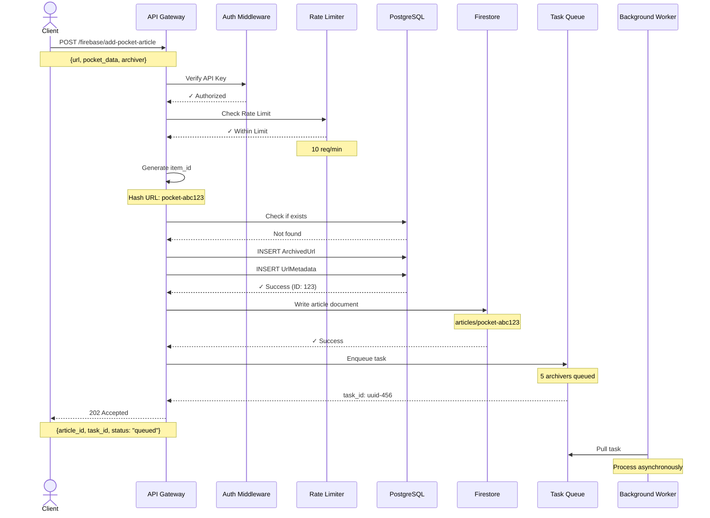
```mermaid
sequenceDiagram
    actor Client
    participant API as API Gateway
    participant Auth as Auth Middleware
    participant RateLimit as Rate Limiter
    participant PG as PostgreSQL
    participant FS as Firestore
    participant Queue as Task Queue
    participant Worker as Background Worker

    Client->>API: POST /firebase/add-pocket-article
    Note over Client,API: {url, pocket_data, archiver}

    API->>Auth: Verify API Key
    Auth-->>API: ✓ Authorized

    API->>RateLimit: Check Rate Limit
    RateLimit-->>API: ✓ Within Limit
    Note over RateLimit: 10 req/min

    API->>API: Generate item_id
    Note over API: Hash URL: pocket-abc123

    API->>PG: Check if exists
    PG-->>API: Not found

    API->>PG: INSERT ArchivedUrl
    API->>PG: INSERT UrlMetadata
    PG-->>API: ✓ Success (ID: 123)

    API->>FS: Write article document
    Note over FS: articles/pocket-abc123
    FS-->>API: ✓ Success

    API->>Queue: Enqueue task
    Note over Queue: 5 archivers queued
    Queue-->>API: task_id: uuid-456

    API-->>Client: 202 Accepted
    Note over API,Client: {article_id, task_id, status: "queued"}

    Worker->>Queue: Pull task
    Note over Worker: Process asynchronously
```

### With Existing Article

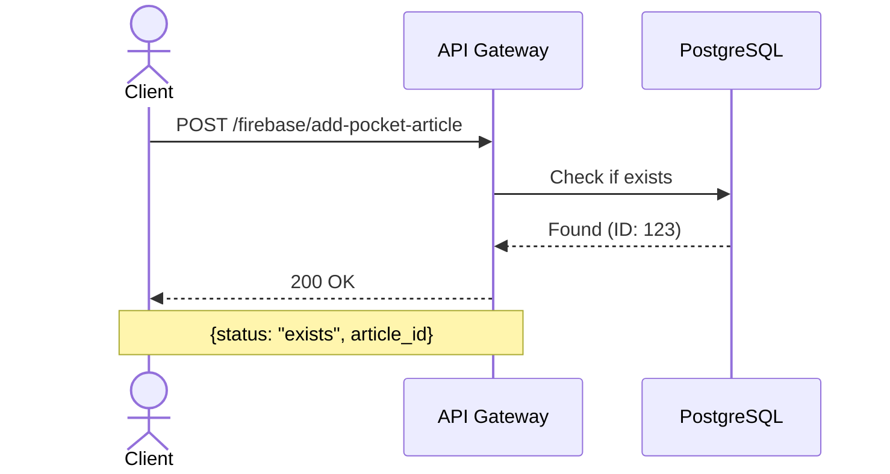
```mermaid
sequenceDiagram
    actor Client
    participant API as API Gateway
    participant PG as PostgreSQL

    Client->>API: POST /firebase/add-pocket-article
    API->>PG: Check if exists
    PG-->>API: Found (ID: 123)
    API-->>Client: 200 OK
    Note over API,Client: {status: "exists", article_id}
```

---

## 2. GET /firebase/download Flow

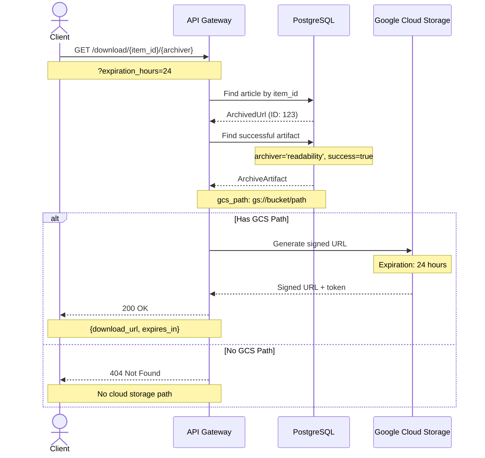
```mermaid
sequenceDiagram
    actor Client
    participant API as API Gateway
    participant PG as PostgreSQL
    participant GCS as Google Cloud Storage

    Client->>API: GET /download/{item_id}/{archiver}
    Note over Client,API: ?expiration_hours=24

    API->>PG: Find article by item_id
    PG-->>API: ArchivedUrl (ID: 123)

    API->>PG: Find successful artifact
    Note over PG: archiver='readability', success=true
    PG-->>API: ArchiveArtifact
    Note over API,PG: gcs_path: gs://bucket/path

    alt Has GCS Path
        API->>GCS: Generate signed URL
        Note over GCS: Expiration: 24 hours
        GCS-->>API: Signed URL + token
        API-->>Client: 200 OK
        Note over API,Client: {download_url, expires_in}
    else No GCS Path
        API-->>Client: 404 Not Found
        Note over API,Client: No cloud storage path
    end
```

---

## 3. Archive Processing Pipeline

### Complete Archiver Flow

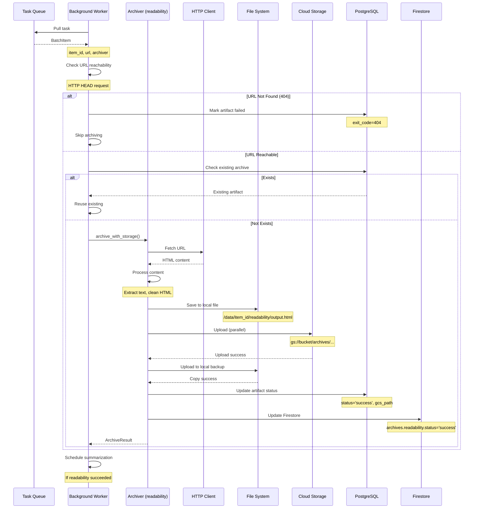
```mermaid
sequenceDiagram
    participant Queue as Task Queue
    participant Worker as Background Worker
    participant Archiver as Archiver (readability)
    participant HTTP as HTTP Client
    participant FS as File System
    participant GCS as Cloud Storage
    participant PG as PostgreSQL
    participant Fire as Firestore

    Worker->>Queue: Pull task
    Queue-->>Worker: BatchItem
    Note over Worker: item_id, url, archiver

    Worker->>Worker: Check URL reachability
    Note over Worker: HTTP HEAD request

    alt URL Not Found (404)
        Worker->>PG: Mark artifact failed
        Note over PG: exit_code=404
        Worker->>Worker: Skip archiving
    else URL Reachable
        Worker->>PG: Check existing archive
        alt Exists
            PG-->>Worker: Existing artifact
            Worker->>Worker: Reuse existing
        else Not Exists
            Worker->>Archiver: archive_with_storage()

            Archiver->>HTTP: Fetch URL
            HTTP-->>Archiver: HTML content

            Archiver->>Archiver: Process content
            Note over Archiver: Extract text, clean HTML

            Archiver->>FS: Save to local file
            Note over FS: /data/item_id/readability/output.html

            Archiver->>GCS: Upload (parallel)
            Note over GCS: gs://bucket/archives/...
            GCS-->>Archiver: Upload success

            Archiver->>FS: Upload to local backup
            FS-->>Archiver: Copy success

            Archiver->>PG: Update artifact status
            Note over PG: status='success', gcs_path

            Archiver->>Fire: Update Firestore
            Note over Fire: archives.readability.status='success'

            Archiver-->>Worker: ArchiveResult
        end
    end

    Worker->>Worker: Schedule summarization
    Note over Worker: If readability succeeded
```

---

## 4. Dual Database Write Flow

### Success Path

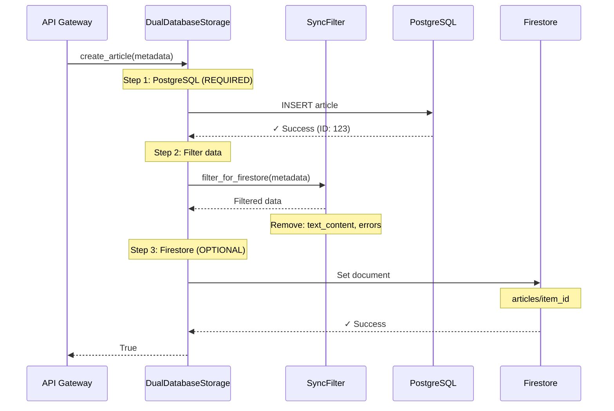
```mermaid
sequenceDiagram
    participant API as API Gateway
    participant Dual as DualDatabaseStorage
    participant Filter as SyncFilter
    participant PG as PostgreSQL
    participant FS as Firestore

    API->>Dual: create_article(metadata)

    Note over Dual: Step 1: PostgreSQL (REQUIRED)
    Dual->>PG: INSERT article
    PG-->>Dual: ✓ Success (ID: 123)

    Note over Dual: Step 2: Filter data
    Dual->>Filter: filter_for_firestore(metadata)
    Filter-->>Dual: Filtered data
    Note over Filter: Remove: text_content, errors

    Note over Dual: Step 3: Firestore (OPTIONAL)
    Dual->>FS: Set document
    Note over FS: articles/item_id
    FS-->>Dual: ✓ Success

    Dual-->>API: True
```

### Firestore Failure (log_and_continue)

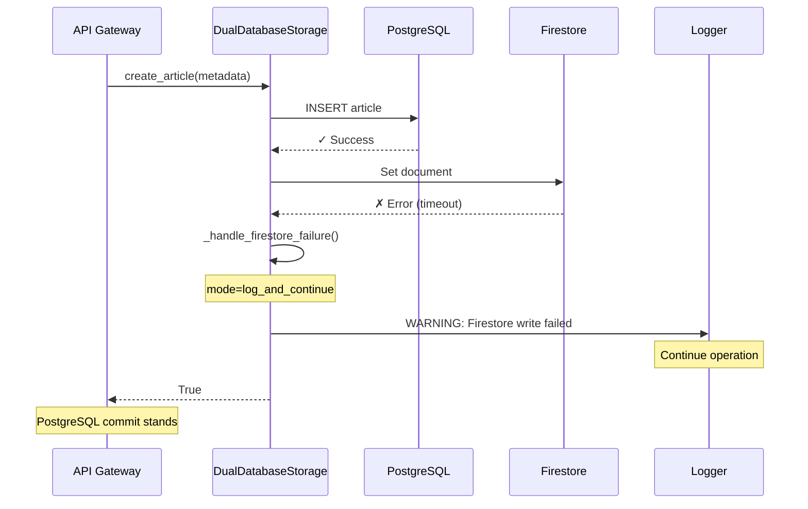
```mermaid
sequenceDiagram
    participant API as API Gateway
    participant Dual as DualDatabaseStorage
    participant PG as PostgreSQL
    participant FS as Firestore
    participant Log as Logger

    API->>Dual: create_article(metadata)

    Dual->>PG: INSERT article
    PG-->>Dual: ✓ Success

    Dual->>FS: Set document
    FS-->>Dual: ✗ Error (timeout)

    Dual->>Dual: _handle_firestore_failure()
    Note over Dual: mode=log_and_continue

    Dual->>Log: WARNING: Firestore write failed
    Note over Log: Continue operation

    Dual-->>API: True
    Note over API: PostgreSQL commit stands
```

### Firestore Failure (fail_fast)

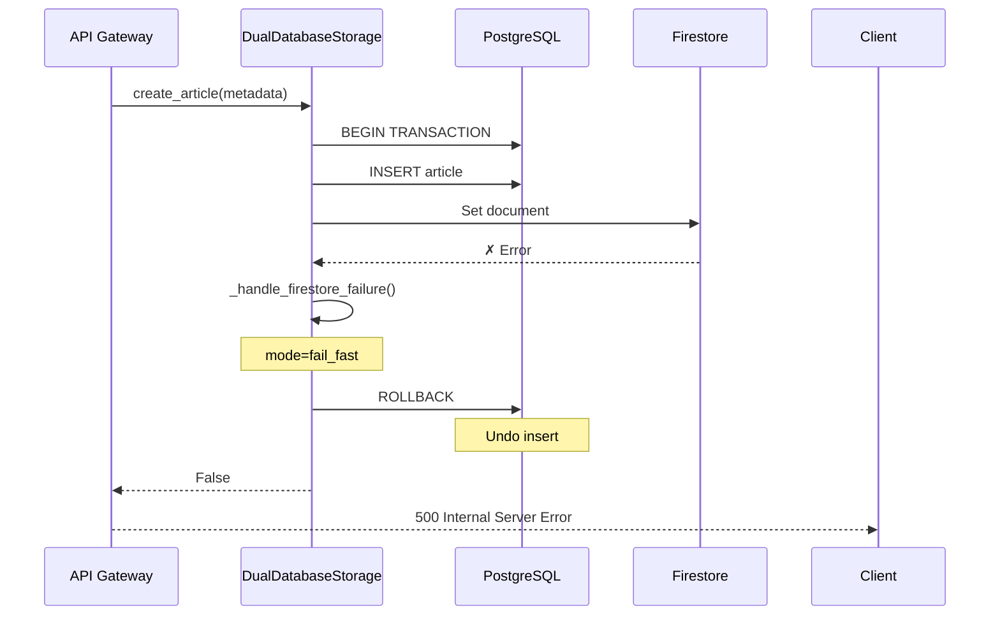
```mermaid
sequenceDiagram
    participant API as API Gateway
    participant Dual as DualDatabaseStorage
    participant PG as PostgreSQL
    participant FS as Firestore

    API->>Dual: create_article(metadata)

    Dual->>PG: BEGIN TRANSACTION
    Dual->>PG: INSERT article

    Dual->>FS: Set document
    FS-->>Dual: ✗ Error

    Dual->>Dual: _handle_firestore_failure()
    Note over Dual: mode=fail_fast

    Dual->>PG: ROLLBACK
    Note over PG: Undo insert

    Dual-->>API: False
    API-->>Client: 500 Internal Server Error
```

---

## 5. Error Handling Flows

### URL Not Reachable (404)

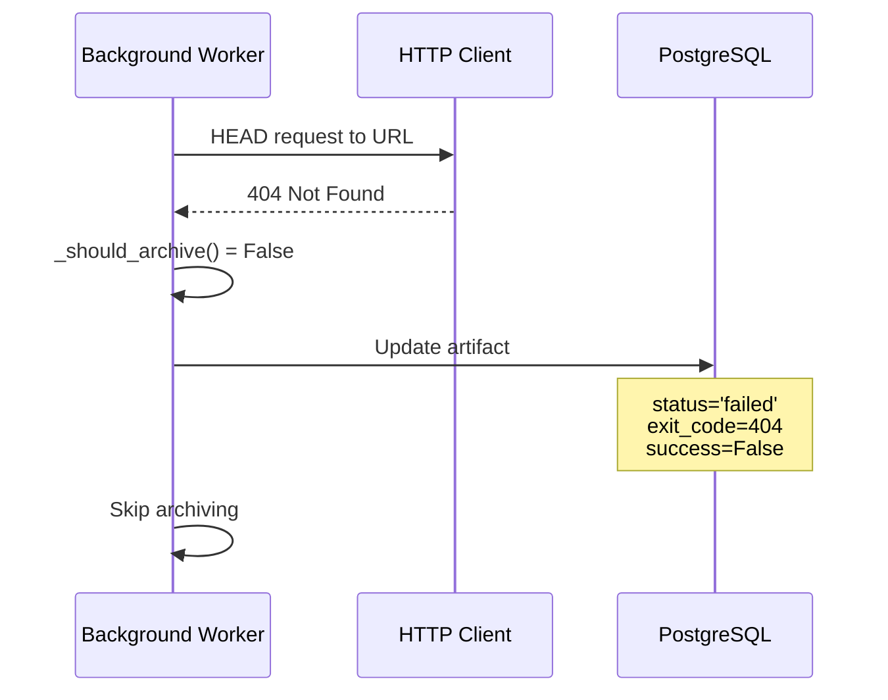
```mermaid
sequenceDiagram
    participant Worker as Background Worker
    participant HTTP as HTTP Client
    participant PG as PostgreSQL

    Worker->>HTTP: HEAD request to URL
    HTTP-->>Worker: 404 Not Found

    Worker->>Worker: _should_archive() = False

    Worker->>PG: Update artifact
    Note over PG: status='failed'<br/>exit_code=404<br/>success=False

    Worker->>Worker: Skip archiving
```

### Archiver Failure

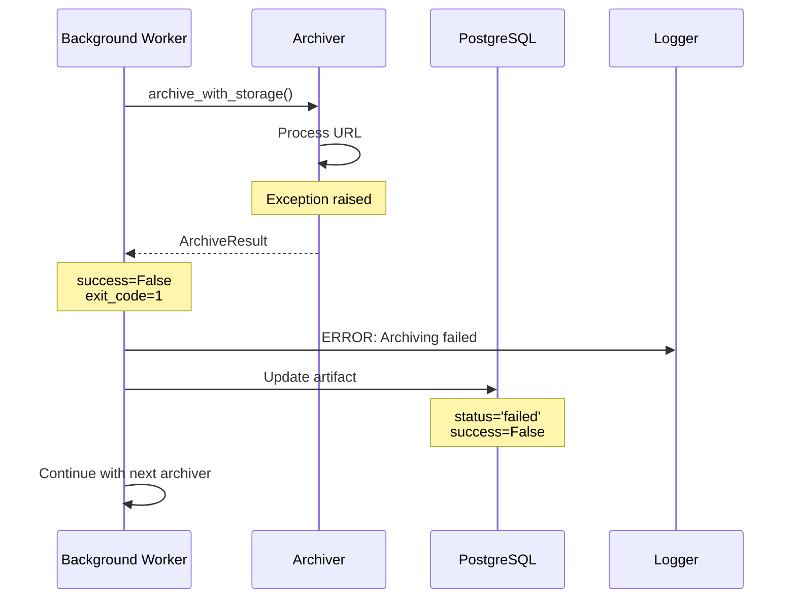
```mermaid
sequenceDiagram
    participant Worker as Background Worker
    participant Archiver as Archiver
    participant PG as PostgreSQL
    participant Log as Logger

    Worker->>Archiver: archive_with_storage()

    Archiver->>Archiver: Process URL
    Note over Archiver: Exception raised

    Archiver-->>Worker: ArchiveResult
    Note over Worker: success=False<br/>exit_code=1

    Worker->>Log: ERROR: Archiving failed

    Worker->>PG: Update artifact
    Note over PG: status='failed'<br/>success=False

    Worker->>Worker: Continue with next archiver
```

### Storage Upload Failure

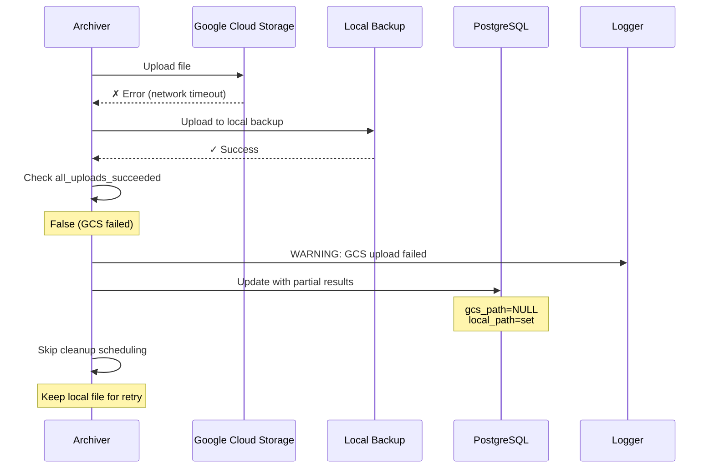
```mermaid
sequenceDiagram
    participant Archiver as Archiver
    participant GCS as Google Cloud Storage
    participant Local as Local Backup
    participant PG as PostgreSQL
    participant Log as Logger

    Archiver->>GCS: Upload file
    GCS-->>Archiver: ✗ Error (network timeout)

    Archiver->>Local: Upload to local backup
    Local-->>Archiver: ✓ Success

    Archiver->>Archiver: Check all_uploads_succeeded
    Note over Archiver: False (GCS failed)

    Archiver->>Log: WARNING: GCS upload failed

    Archiver->>PG: Update with partial results
    Note over PG: gcs_path=NULL<br/>local_path=set

    Archiver->>Archiver: Skip cleanup scheduling
    Note over Archiver: Keep local file for retry
```

---

## 6. Complete End-to-End Flow

### From Client Request to Completion

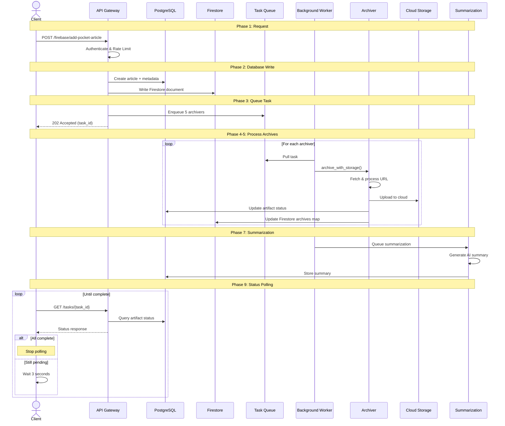
```mermaid
sequenceDiagram
    actor Client
    participant API as API Gateway
    participant PG as PostgreSQL
    participant FS as Firestore
    participant Queue as Task Queue
    participant Worker as Background Worker
    participant Arch as Archiver
    participant GCS as Cloud Storage
    participant Sum as Summarization

    Note over Client,Sum: Phase 1: Request
    Client->>API: POST /firebase/add-pocket-article
    API->>API: Authenticate & Rate Limit

    Note over Client,Sum: Phase 2: Database Write
    API->>PG: Create article + metadata
    API->>FS: Write Firestore document

    Note over Client,Sum: Phase 3: Queue Task
    API->>Queue: Enqueue 5 archivers
    API-->>Client: 202 Accepted (task_id)

    Note over Client,Sum: Phase 4-5: Process Archives
    loop For each archiver
        Worker->>Queue: Pull task
        Worker->>Arch: archive_with_storage()
        Arch->>Arch: Fetch & process URL
        Arch->>GCS: Upload to cloud
        Arch->>PG: Update artifact status
        Arch->>FS: Update Firestore archives map
    end

    Note over Client,Sum: Phase 7: Summarization
    Worker->>Sum: Queue summarization
    Sum->>Sum: Generate AI summary
    Sum->>PG: Store summary

    Note over Client,Sum: Phase 9: Status Polling
    loop Until complete
        Client->>API: GET /tasks/{task_id}
        API->>PG: Query artifact status
        API-->>Client: Status response
        alt All complete
            Note over Client: Stop polling
        else Still pending
            Client->>Client: Wait 3 seconds
        end
    end
```

---

## 7. Artifact Status State Machine

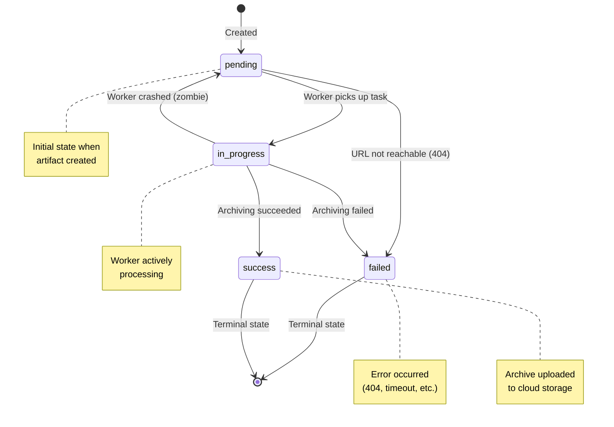
```mermaid
stateDiagram-v2
    [*] --> pending: Created

    pending --> in_progress: Worker picks up task
    pending --> failed: URL not reachable (404)

    in_progress --> success: Archiving succeeded
    in_progress --> failed: Archiving failed
    in_progress --> pending: Worker crashed (zombie)

    failed --> [*]: Terminal state
    success --> [*]: Terminal state

    note right of pending
        Initial state when<br/>artifact created
    end note

    note right of in_progress
        Worker actively<br/>processing
    end note

    note right of success
        Archive uploaded<br/>to cloud storage
    end note

    note right of failed
        Error occurred<br/>(404, timeout, etc.)
    end note
```

---

## 8. Threading Architecture

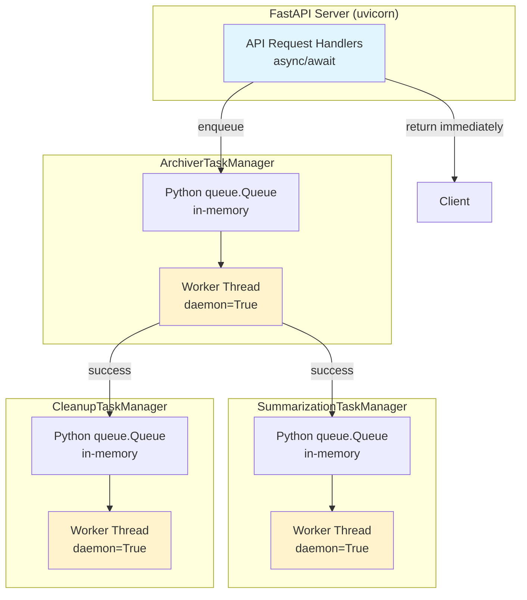
```mermaid
graph TB
    subgraph "FastAPI Server (uvicorn)"
        API[API Request Handlers<br/>async/await]
    end

    subgraph "ArchiverTaskManager"
        AQueue[Python queue.Queue<br/>in-memory]
        AWorker[Worker Thread<br/>daemon=True]
    end

    subgraph "SummarizationTaskManager"
        SQueue[Python queue.Queue<br/>in-memory]
        SWorker[Worker Thread<br/>daemon=True]
    end

    subgraph "CleanupTaskManager"
        CQueue[Python queue.Queue<br/>in-memory]
        CWorker[Worker Thread<br/>daemon=True]
    end

    API -->|enqueue| AQueue
    API -->|return immediately| Client[Client]
    AQueue --> AWorker
    AWorker -->|success| SQueue
    AWorker -->|success| CQueue

    SQueue --> SWorker
    CQueue --> CWorker

    style API fill:#e1f5ff
    style AWorker fill:#fff3cd
    style SWorker fill:#fff3cd
    style CWorker fill:#fff3cd
```

---

## 9. Data Flow Diagram

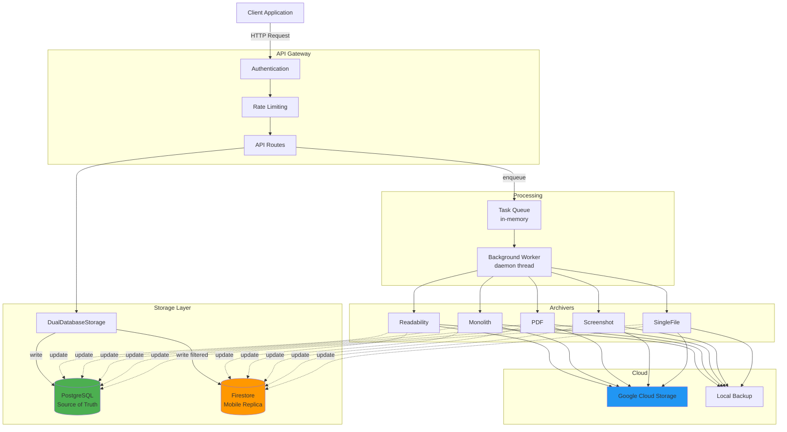
```mermaid
flowchart TD
    Client[Client Application]

    subgraph API Gateway
        Auth[Authentication]
        RateLimit[Rate Limiting]
        Routes[API Routes]
    end

    subgraph Storage Layer
        Dual[DualDatabaseStorage]
        PG[(PostgreSQL<br/>Source of Truth)]
        FS[(Firestore<br/>Mobile Replica)]
    end

    subgraph Processing
        Queue[Task Queue<br/>in-memory]
        Worker[Background Worker<br/>daemon thread]
    end

    subgraph Archivers
        Read[Readability]
        Mono[Monolith]
        PDF[PDF]
        Screen[Screenshot]
        Single[SingleFile]
    end

    subgraph Cloud
        GCS[Google Cloud Storage]
        Local[Local Backup]
    end

    Client -->|HTTP Request| Auth
    Auth --> RateLimit
    RateLimit --> Routes

    Routes --> Dual
    Dual -->|write| PG
    Dual -->|write filtered| FS

    Routes -->|enqueue| Queue
    Queue --> Worker

    Worker --> Read
    Worker --> Mono
    Worker --> PDF
    Worker --> Screen
    Worker --> Single

    Read --> GCS
    Mono --> GCS
    PDF --> GCS
    Screen --> GCS
    Single --> GCS

    Read --> Local
    Mono --> Local
    PDF --> Local
    Screen --> Local
    Single --> Local

    Read -.update.-> PG
    Mono -.update.-> PG
    PDF -.update.-> PG
    Screen -.update.-> PG
    Single -.update.-> PG

    Read -.update.-> FS
    Mono -.update.-> FS
    PDF -.update.-> FS
    Screen -.update.-> FS
    Single -.update.-> FS

    style PG fill:#4CAF50
    style FS fill:#FF9800
    style GCS fill:#2196F3
```

---

## 10. Reconciliation Flow

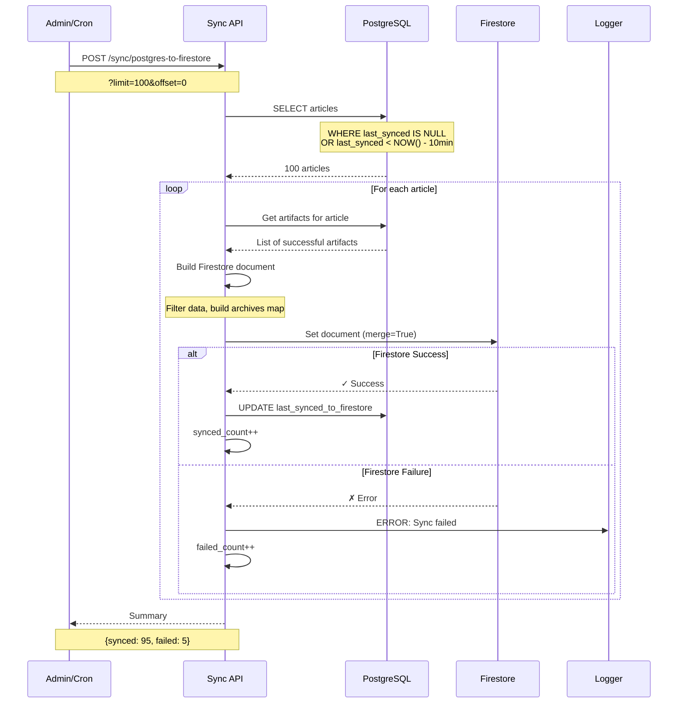
```mermaid
sequenceDiagram
    participant Admin as Admin/Cron
    participant API as Sync API
    participant PG as PostgreSQL
    participant FS as Firestore
    participant Log as Logger

    Admin->>API: POST /sync/postgres-to-firestore
    Note over Admin,API: ?limit=100&offset=0

    API->>PG: SELECT articles
    Note over PG: WHERE last_synced IS NULL<br/>OR last_synced < NOW() - 10min
    PG-->>API: 100 articles

    loop For each article
        API->>PG: Get artifacts for article
        PG-->>API: List of successful artifacts

        API->>API: Build Firestore document
        Note over API: Filter data, build archives map

        API->>FS: Set document (merge=True)

        alt Firestore Success
            FS-->>API: ✓ Success
            API->>PG: UPDATE last_synced_to_firestore
            API->>API: synced_count++
        else Firestore Failure
            FS-->>API: ✗ Error
            API->>Log: ERROR: Sync failed
            API->>API: failed_count++
        end
    end

    API-->>Admin: Summary
    Note over API,Admin: {synced: 95, failed: 5}
```

---

## 11. Rate Limiting Flow

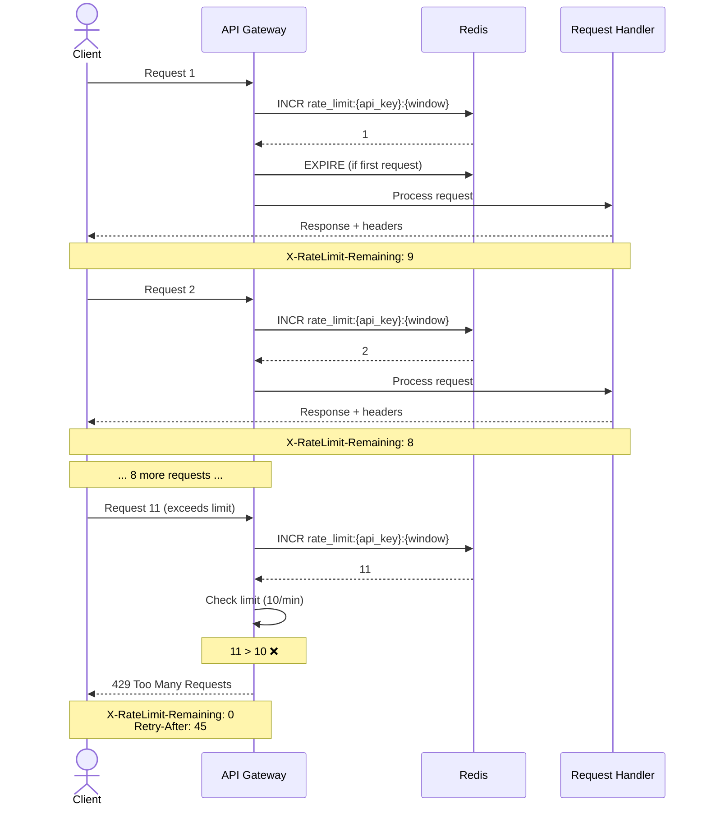
```mermaid
sequenceDiagram
    actor Client
    participant API as API Gateway
    participant Redis as Redis
    participant Handler as Request Handler

    Client->>API: Request 1
    API->>Redis: INCR rate_limit:{api_key}:{window}
    Redis-->>API: 1
    API->>Redis: EXPIRE (if first request)
    API->>Handler: Process request
    Handler-->>Client: Response + headers
    Note over Handler,Client: X-RateLimit-Remaining: 9

    Client->>API: Request 2
    API->>Redis: INCR rate_limit:{api_key}:{window}
    Redis-->>API: 2
    API->>Handler: Process request
    Handler-->>Client: Response + headers
    Note over Handler,Client: X-RateLimit-Remaining: 8

    Note over Client,API: ... 8 more requests ...

    Client->>API: Request 11 (exceeds limit)
    API->>Redis: INCR rate_limit:{api_key}:{window}
    Redis-->>API: 11
    API->>API: Check limit (10/min)
    Note over API: 11 > 10 ❌
    API-->>Client: 429 Too Many Requests
    Note over API,Client: X-RateLimit-Remaining: 0<br/>Retry-After: 45
```

---

## Diagram Legend

### Symbols Used

- **Solid Arrow (→)**: Synchronous call/response
- **Dashed Arrow (-.->)**: Asynchronous update
- **Box with Actor**: External user/client
- **Box with Participant**: Internal component
- **Cylinder**: Database
- **Note**: Important information/detail
- **alt/else**: Conditional branching
- **loop**: Repeated operations

### Status Indicators

- **✓**: Success
- **✗**: Failure
- **[*]**: Terminal state (state diagram)

---

## Next Steps

For implementation details:
- **API Documentation:** [FIREBASE_API_FLOW.md](../FIREBASE_API_FLOW.md)
- **Complete Flow:** [REQUEST_FLOW_COMPLETE.md](../REQUEST_FLOW_COMPLETE.md)
- **Database Pattern:** [DUAL_DATABASE_ARCHITECTURE.md](../DUAL_DATABASE_ARCHITECTURE.md)
- **Architecture:** [ARCHITECTURE_OVERVIEW.md](../ARCHITECTURE_OVERVIEW.md)
